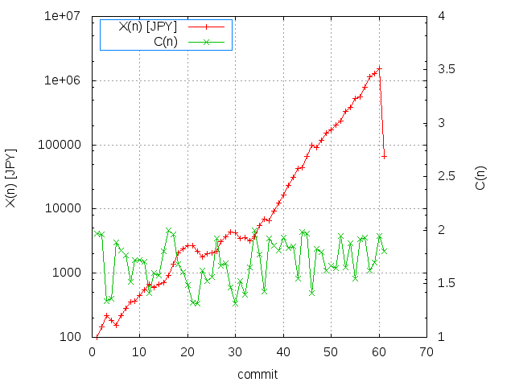
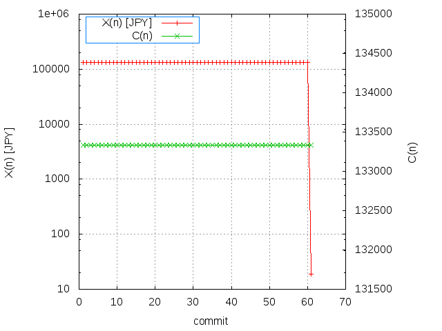

# subcon models

## Description 

This repository shows a list of models which are used for each subcon on a case-by-case.

## Models

 * <a href="./model.001">model.001</a>: EEM - Exponential Evolutional Model

 * <a href="./model.002">model.002</a>: LEM - Linear Evolutional Model

 * <a href="./model.003">model.003</a>: PEM - Parabolic Evolutional Model

## Comparision

|Model|budget|X  |  C  |
|:---|:---:|:---:|:---:|
| EEM ||||
| LEM ||||
| PEM ||||

## RELV: Rwanda Ether Level

Each subcon work requires your RELV(Rwanda Ether Level) to join.
It depends on the total amount of budget V(0) as follows.
For example, if your level is 3, you can only join the subcon work less than V(0)=15000.
This limitation is called Vmax.

* Vmax = 5000 * RELV

|RELV | Vmax |
|---:|---:|
| 1 |   5000  |
| 2 |   10000 |
| 3 |   15000 |
| 4 |   20000 |
| 5 |   25000 |
| 6 |   30000 |
| 7 |   35000 |
| 8 |   40000 |
| 9 |   45000 |
| 10 |   50000 |
| 11 |   55000 |
| 12 |   60000 |
| 13 |   65000 |
| 14 |   70000 |
| 15 |   75000 |
| 16 |   80000 |
| 17 |   85000 |
| 18 |   90000 |
| 19 |   95000 |
| 20 |   100000 |

