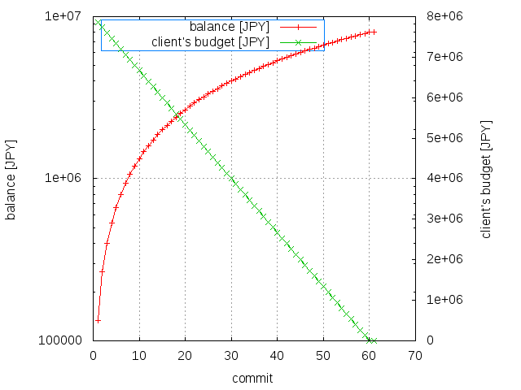

# subcon models

## Description 

This repository shows a list of models which are used for each subcon on a case-by-case.

## Models

 * <a href="./model.001">model.001</a>: EEM - Exponential Evolutional Model

 * <a href="./model.002">model.002</a>: LEM - Linear Evolutional Model

 * <a href="./model.003">model.003</a>: PEM - Parabolic Evolutional Model

## Comparision

| EEM | |
|:---|:---:|
| LEM | |
| PEM | |

